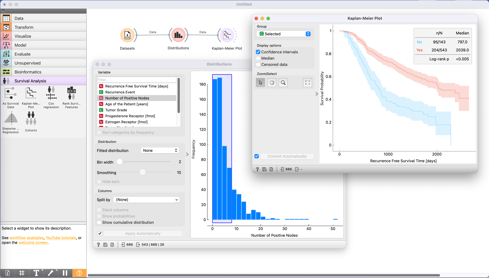

<h1 align="center">Orange3-Survival-Analysis</h1>

Survival analysis add-on for the [Orange](http://orange.biolab.si)
data mining suite. For more see the [widget documentation](https://orangedatamining.com/widget-catalog/survival-analysis/kaplan-meier-plot/)
and [example workflows](https://orangedatamining.com/workflows/Survival-Analysis/).

Blog posts:
- [An introduction to the Kaplan-Meier Estimator](https://orangedatamining.com/blog/2022/2022-05-25-KaplanMeier/)
- [Cox regression in Orange](https://orangedatamining.com/blog/2023/2023-01-27-cox-regression-in-orange/)

# Easy installation

First, [download](https://orange.biolab.si/download) the latest Orange release from
our website. Then, to install the survival analysis add-on, head to
`Options -> Add-ons...` in the menu bar.

# For developers

If you would like to install from cloned git repository, run

    pip install .

To register this add-on with Orange, but keep the code in the development directory
(do not copy it to Python's site-packages directory), run

    pip install -e .

###  Usage

After the installation, the widget from this add-on is registered with Orange. To run Orange from the terminal,
use

    orange-canvas

or

    python -m Orange.canvas

The new widget appears in the toolbox bar under the section Survival Analysis.
Starting up for the first time may take a while.
